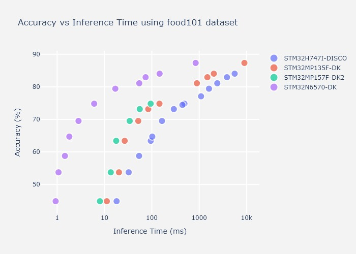
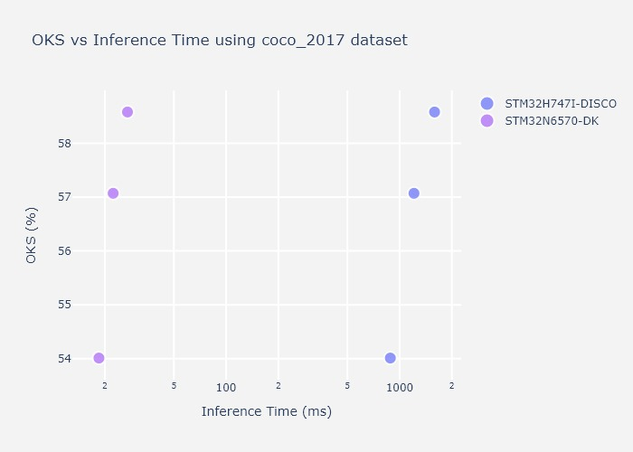
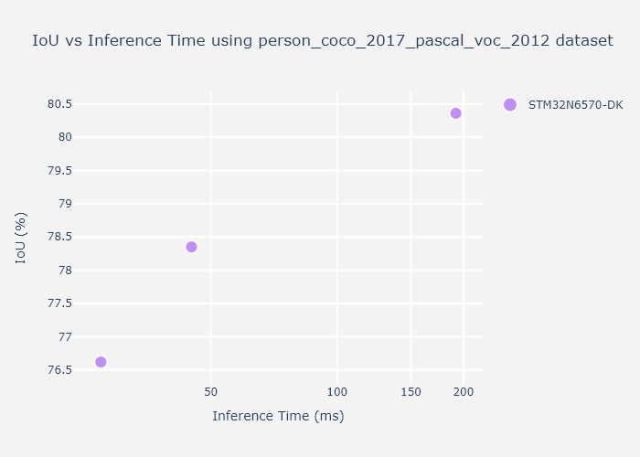
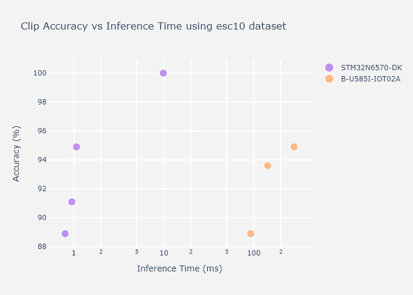

# STMicroelectronics – STM32 model zoo services

Welcome to STM32 model zoo services!

The STM32 AI model zoo is a set of services and scripts used to ease end to end AI models integration on ST devices. This can be used in conjunction of the [STM32 model zoo](https://github.com/STMicroelectronics/stm32ai-modelzoo/) which contains a collection of reference machine learning models optimized to run on STM32 microcontrollers.
Available on GitHub, this is a valuable resource for anyone looking to add AI capabilities to their STM32-based projects.

- Scripts to easily retrain or fine-tune any model from user datasets (BYOD and BYOM)
- A set of services and chained services to quantize, benchmark, predict and evaluate any model (BYOM)
- Application code examples automatically generated from user AI models

These models can be useful for quick deployment if you are interested in the categories they were trained on. We also provide training scripts to do transfer learning or to train your own model from scratch on your custom dataset.

The performances on reference STM32 MCU and MPU are provided for float and quantized models.

This project is organized by application, for each application you will have a step by step guide that will indicate how to train and deploy the models.

## What's new in releases :
<details open><summary><b>3.0:</b></summary>

* Full support of the new [STM32N6570-DK](https://www.st.com/en/evaluation-tools/stm32n6570-dk) board.
* Included additional models compatible with the `STM32N6`.
* Included support for `STEdgeAI Core v2.0.0` (STM32Cube.AI v10.0.0).
* Split of model zoo and services into two GitHub repositories
* Integrated support for `ONNX model` quantization and evaluation from h5 models.
* Expanded use case support to include `Instance Segmentation` and `Speech Enhancement`.
* Added `Pytorch` support through the speech enhancement Use Case.
* Support of `On device evaluation and prediction` on the `STM32N6570-DK` boards.
* Model Zoo hosted on <a href="#Hugging Face">Hugging Face</a>

</details>
<details><summary><b>2.1:</b></summary>

* Included additional models compatible with the [STM32MP257F-EV1](https://www.st.com/en/evaluation-tools/stm32mp257f-ev1) board.
* Added support for per-tensor quantization.
* Integrated support for `ONNX model` quantization and evaluation.
* Included support for `STEdgeAI` (STM32Cube.AI v10.0.0 and subsequent versions).
* Expanded use case support to include `Pose Estimation` and `Semantic Segmentation`.
* Standardized logging information for a unified experience.
</details>
<details><summary><b>2.0:</b></summary>

* An aligned and `uniform architecture` for all the use case
* A modular design to run different operation modes (training, benchmarking, evaluation, deployment, quantization) independently or with an option of chaining multiple modes in a single launch.
* A simple and `single entry point` to the code : a .yaml configuration file to configure all the needed services.
* Support of the `Bring Your Own Model (BYOM)` feature to allow the user (re-)training his own model. Example is provided [here](./image_classification/src/training/README.md#51-training-your-own-model), chapter 5.1.
* Support of the `Bring Your Own Data (BYOD)` feature to allow the user finetuning some pretrained models with his own datasets. Example is provided [here](./image_classification/src/training/README.md#23-dataset-specification), chapter 2.3.
</details>

<div align="center" style="margin-top: 80px; padding: 20px 0;">
    <p align="center">
        <a href="https://www.python.org/downloads/" target="_blank"></a>
        <a href="https://www.tensorflow.org/install/pip" target="_blank"></a>
        <a href="https://stedgeai-dc.st.com/home"></a>  
    </p>
</div>

## Available use-cases
The ST model zoo provides a collection of independent `services` and pre-built `chained services` that can be used to perform various functions related to machine learning. The individual services include tasks such as training or quantization of a model, while the chained services combine multiple services to perform more complex functions, such as training the model, quantizing it, and evaluating the quantized model successively before benchmarking it on a HW of your choice.

**All trained models in the [STM32 model zoo](https://github.com/STMicroelectronics/stm32ai-modelzoo/) are provided with their configuration .yaml file used to generate them. This is a very good baseline to start with!**

>[!TIP]
> All services are available for following use cases with quick and easy examples that are provided and can be executed for a fast ramp up (click on use cases links below). 
* <a href="#IC">Image Classification</a>
* <a href="#OD">Object Detection</a>
* <a href="#PE">Pose Estimation</a>
* <a href="#SemSeg">Semantic Segmentation</a>
* <a href="#InstSeg">Instance Segmentation</a>
* <a href="#AED">Audio Event Detection</a>
* <a href="#SE">Speech Enhancement</a>
* <a href="#HAR">Human Activity Recognition</a>
* <a href="#HPR">Hand Posture Recognition</a>

## <a id="IC">Image Classification</a>
Image classification is used to classify the content of an image within a predefined set of classes. Only one class is predicted from an input image.

<div align="center" style="width:100%; margin: auto;">


</div>

<details open><summary><b>Image classification (IC) models</b></summary>

| Models             | Input Resolutions | Supported Services    | Suitable Targets for deployment |
|--------------------|------------------|-----------------------|-------------------|
| [MobileNet v1 0.25](https://github.com/STMicroelectronics/stm32ai-modelzoo/blob/master/image_classification/mobilenetv1/README.md)   | 96x96x1<br> 96x96x3<br> 224x224x3     | Full IC Services      | [STM32H747I-DISCO](application_code/image_classification/STM32H7/Application/STM32H747I-DISCO) with B-CAMS-OMV camera daughter board<br> [NUCLEO-H743ZI2](application_code/image_classification/STM32H7/Application/NUCLEO-H743ZI2) with B-CAMS-OMV camera daughter board<br>   |
| [MobileNet v1 0.5](https://github.com/STMicroelectronics/stm32ai-modelzoo/blob/master/image_classification/mobilenetv1/README.md)   | 224x224x3     | Full IC Services      | [STM32H747I-DISCO](application_code/image_classification/STM32H7/Application/STM32H747I-DISCO) with B-CAMS-OMV camera daughter board<br> [NUCLEO-H743ZI2](application_code/image_classification/STM32H7/Application/NUCLEO-H743ZI2) with B-CAMS-OMV camera daughter board<br>   | 
| [MobileNet v1 1.0](https://github.com/STMicroelectronics/stm32ai-modelzoo/blob/master/image_classification/mobilenetv1/README.md)   | 224x224x3     | Full IC Services      | [STM32MP257F-EV1](./application_code/image_classification/STM32MP-LINUX/STM32MP2/README.md)<br> [STM32N6570-DK](https://www.st.com/en/development-tools/stm32n6-ai.html)<br>  | 
| [MobileNet v2 0.35](https://github.com/STMicroelectronics/stm32ai-modelzoo/blob/master/image_classification/mobilenetv2/README.md)   | 128x128x3<br>  224x224x3     | Full IC Services      | [STM32H747I-DISCO](application_code/image_classification/STM32H7/Application/STM32H747I-DISCO) with B-CAMS-OMV camera daughter board<br> [NUCLEO-H743ZI2](application_code/image_classification/STM32H7/Application/NUCLEO-H743ZI2) with B-CAMS-OMV camera daughter board<br>   |
| [MobileNet v2 1.0](https://github.com/STMicroelectronics/stm32ai-modelzoo/blob/master/image_classification/mobilenetv2/README.md)   |  224x224x3     | Full IC Services      |  [STM32MP257F-EV1](./application_code/image_classification/STM32MP-LINUX/STM32MP2/README.md)<br> [STM32N6570-DK](https://www.st.com/en/development-tools/stm32n6-ai.html)<br>  |
| [MobileNet v2 1.4](https://github.com/STMicroelectronics/stm32ai-modelzoo/blob/master/image_classification/mobilenetv2/README.md)   |  224x224x3     | Full IC Services      |  [STM32MP257F-EV1](./application_code/image_classification/STM32MP-LINUX/STM32MP2/README.md)<br> [STM32N6570-DK](https://www.st.com/en/development-tools/stm32n6-ai.html)<br>  |
| [ResNet8 v1](https://github.com/STMicroelectronics/stm32ai-modelzoo/blob/master/image_classification/resnetv1/README.md)   | 32x32x3     | Full IC Services      | [STM32H747I-DISCO](application_code/image_classification/STM32H7/Application/STM32H747I-DISCO) with B-CAMS-OMV camera daughter board<br> [NUCLEO-H743ZI2](application_code/image_classification/STM32H7/Application/NUCLEO-H743ZI2) with B-CAMS-OMV camera daughter board<br>   |
| [ST ResNet8](https://github.com/STMicroelectronics/stm32ai-modelzoo/blob/master/image_classification/resnetv1/README.md)   | 32x32x3     | Full IC Services      | [STM32H747I-DISCO](application_code/image_classification/STM32H7/Application/STM32H747I-DISCO) with B-CAMS-OMV camera daughter board<br> [NUCLEO-H743ZI2](application_code/image_classification/STM32H7/Application/NUCLEO-H743ZI2) with B-CAMS-OMV camera daughter board<br>   |
| [ResNet32 v1](https://github.com/STMicroelectronics/stm32ai-modelzoo/blob/master/image_classification/resnetv1/README.md)   | 32x32x3     | Full IC Services      | [STM32H747I-DISCO](application_code/image_classification/STM32H7/Application/STM32H747I-DISCO) with B-CAMS-OMV camera daughter board<br> [NUCLEO-H743ZI2](application_code/image_classification/STM32H7/Application/NUCLEO-H743ZI2) with B-CAMS-OMV camera daughter board<br>   |
| [ResNet50 v2](https://github.com/STMicroelectronics/stm32ai-modelzoo/blob/master/image_classification/resnet50v2/README.md)   |  224x224x3     | Full IC Services      |  [STM32MP257F-EV1](./application_code/image_classification/STM32MP-LINUX/STM32MP2/README.md)<br> [STM32N6570-DK](https://www.st.com/en/development-tools/stm32n6-ai.html)<br>  |
| [SqueezeNet v1.1](https://github.com/STMicroelectronics/stm32ai-modelzoo/blob/master/image_classification/squeezenetv1.1/README.md)   | 128x128x3<br>  224x224x3     | Full IC Services      | [STM32H747I-DISCO](application_code/image_classification/STM32H7/Application/STM32H747I-DISCO) with B-CAMS-OMV camera daughter board<br> [NUCLEO-H743ZI2](application_code/image_classification/STM32H7/Application/NUCLEO-H743ZI2) with B-CAMS-OMV camera daughter board<br>   |
| [FD MobileNet 0.25](https://github.com/STMicroelectronics/stm32ai-modelzoo/blob/master/image_classification/fdmobilenet/README.md)   | 128x128x3<br>  224x224x3     | Full IC Services      | [STM32H747I-DISCO](application_code/image_classification/STM32H7/Application/STM32H747I-DISCO) with B-CAMS-OMV camera daughter board<br> [NUCLEO-H743ZI2](application_code/image_classification/STM32H7/Application/NUCLEO-H743ZI2) with B-CAMS-OMV camera daughter board<br>   |
| [ST FD MobileNet](https://github.com/STMicroelectronics/stm32ai-modelzoo/blob/master/image_classification/fdmobilenet/README.md)   | 128x128x3<br>  224x224x3     | Full IC Services      | [STM32H747I-DISCO](application_code/image_classification/STM32H7/Application/STM32H747I-DISCO) with B-CAMS-OMV camera daughter board<br> [NUCLEO-H743ZI2](application_code/image_classification/STM32H7/Application/NUCLEO-H743ZI2) with B-CAMS-OMV camera daughter board<br>   |
| [ST EfficientNet](https://github.com/STMicroelectronics/stm32ai-modelzoo/blob/master/image_classification/efficientnet/README.md)   | 128x128x3<br>  224x224x3     | Full IC Services      | [STM32H747I-DISCO](application_code/image_classification/STM32H7/Application/STM32H747I-DISCO) with B-CAMS-OMV camera daughter board<br> [NUCLEO-H743ZI2](application_code/image_classification/STM32H7/Application/NUCLEO-H743ZI2) with B-CAMS-OMV camera daughter board<br>   |
| [EfficientNet v2](https://github.com/STMicroelectronics/stm32ai-modelzoo/blob/master/image_classification/efficientnetv2/README.md)   |  224x224x3<br> 240x240x3<br> 260x260x3<br> 384x384x3<br>    | Full IC Services      |  [STM32MP257F-EV1](./application_code/image_classification/STM32MP-LINUX/STM32MP2/README.md)<br> [STM32N6570-DK](https://www.st.com/en/development-tools/stm32n6-ai.html)<br>  |
| [Mnist](https://github.com/STMicroelectronics/stm32ai-modelzoo/blob/master/image_classification/st_mnist/README.md)   | 28x28x1<br>      | Full IC Services      | [STM32H747I-DISCO](application_code/image_classification/STM32H7/Application/STM32H747I-DISCO) with B-CAMS-OMV camera daughter board<br> [NUCLEO-H743ZI2](application_code/image_classification/STM32H7/Application/NUCLEO-H743ZI2) with B-CAMS-OMV camera daughter board<br>   |

[Full IC Services](image_classification/README.md) : training, evaluation, quantization, benchmarking, prediction, deployment
</details>

Selecting a model for a specific task or a specific device is not always an easy task, and relying on metrics like the inference time and the accuracy as in example figure on food-101 classification below can help making the right choice before fine tuning your model.

<div align="center" style="width:100%; margin: auto;">


</div>

Please find below some tutorials for a quick ramp up!
* [How can I define and train my own model?](./image_classification/deployment/doc/tuto/how_to_define_and_train_my_own_model.md)
* [How can I fine tune a pretrained model on my own dataset?](./image_classification/deployment/doc/tuto/how_to_finetune_a_model_zoo_model_on_my_own_dataset.md)
* [How can I check the accuracy after quantization of my model?](./image_classification/deployment/doc/tuto/how_to_compare_the_accuracy_after_quantization_of_my_model.md)
* [How can I quickly check the performance of my model using the dev cloud?](./image_classification/deployment/doc/tuto/how_to_quickly_benchmark_the_performances_of_a_model.md)


Image Classification top readme **[here](./image_classification/README.md)**

## <a id="OD">Object Detection</a>
Object detection is used to detect, locate and estimate the occurrences probability of predefined objects from input images.  

<div align="center" style="width:80%; margin: auto;">


</div>

<details open><summary><b>Object Detection (OD) Models</b></summary>

| Models             | Input Resolutions | Supported Services    | Targets for deployment |
|--------------------|------------------|-----------------------|-------------------|
| [ST SSD MobileNet v1 0.25](https://github.com/STMicroelectronics/stm32ai-modelzoo/blob/master/object_detection/st_ssd_mobilenet_v1/README.md)   |  192x192x3<br> 224x224x3<br> 256x256x3<br>  | Full OD Services      | [STM32H747I-DISCO](application_code/object_detection/STM32H7/Application/STM32H747I-DISCO) with B-CAMS-OMV camera daughter board<br>    |
| [SSD MobileNet v2 fpn lite 0.35](https://github.com/STMicroelectronics/stm32ai-modelzoo/blob/master/object_detection/ssd_mobilenet_v2_fpnlite/README.md)   |  192x192x3<br> 224x224x3<br> 256x256x3<br> 416x416x3   | Full OD Services      | [STM32H747I-DISCO](application_code/object_detection/STM32H7/Application/STM32H747I-DISCO) with B-CAMS-OMV camera daughter board<br> [STM32MP257F-EV1](./application_code/object_detection/STM32MP-LINUX/STM32MP2/README.md) <br> [STM32N6570-DK](https://www.st.com/en/development-tools/stm32n6-ai.html)<br>    |
| [SSD MobileNet v2 fpn lite 1.0](https://github.com/STMicroelectronics/stm32ai-modelzoo/blob/master/object_detection/ssd_mobilenet_v2_fpnlite/README.md)   |  256x256x3<br> 416x416x3   | Full OD Services      |  [STM32MP257F-EV1](./application_code/object_detection/STM32MP-LINUX/STM32MP2/README.md) <br> [STM32N6570-DK](https://www.st.com/en/development-tools/stm32n6-ai.html)<br>     |
| [ST Yolo LC v1](https://github.com/STMicroelectronics/stm32ai-modelzoo/blob/master/object_detection/st_yolo_lc_v1/README.md)   |  192x192x3<br> 224x224x3<br> 256x256x3<br>  | Full OD Services      | [STM32H747I-DISCO](application_code/object_detection/STM32H7/Application/STM32H747I-DISCO) with B-CAMS-OMV camera daughter board<br>  |
| [Tiny Yolo v2](https://github.com/STMicroelectronics/stm32ai-modelzoo/blob/master/object_detection/tiny_yolo_v2/README.md)   |  224x224x3<br> 416x416x3<br>  | Full OD Services      | [STM32N6570-DK](https://www.st.com/en/development-tools/stm32n6-ai.html)<br>     |
| [ST Yolo X](https://github.com/STMicroelectronics/stm32ai-modelzoo/blob/master/object_detection/st_yolo_x/README.md)   |  256x256x3<br> 416x416x3<br>  | Full OD Services      | [STM32N6570-DK](https://www.st.com/en/development-tools/stm32n6-ai.html)<br>     |
| [Yolo v8](https://github.com/stm32-hotspot/ultralytics/tree/main/examples/YOLOv8-STEdgeAI/stedgeai_models/object_detection)   |  192x192x3<br> 256x256x3<br> 320x320x3<br> 416x416x3<br>  | Evaluation / Benchmarking / Prediction / Deployment    | [STM32N6570-DK](https://www.st.com/en/development-tools/stm32n6-ai.html)<br>     |


[Full OD Services](object_detection/README.md) : training, evaluation, quantization, benchmarking, prediction, deployment

</details>
Relying on metrics like the inference time and the mean Average Precision (mAP) as in example figure on people detection below can help making the right choice before fine tuning your model, as well as checking HW capabilities for OD task.

<div align="center" style="width:80%; margin: auto;">


</div>

Please find below some tutorials for a quick ramp up!
* [How can I use my own dataset?](./object_detection/deployment/doc/tuto/how_to_use_my_own_object_detection_dataset.md)
* [How can I fine tune a pretrained model on my own dataset?](./object_detection/deployment/doc/tuto/how_to_finetune_a_model_zoo_model_on_my_own_dataset.md)
* [How can I check the accuracy after quantization of my model?](./object_detection/deployment/doc/tuto/how_to_compare_the_accuracy_after_quantization_of_my_model.md)
* [How can I quickly check the performance of my model using the dev cloud?](./object_detection/deployment/doc/tuto/how_to_quickly_benchmark_the_performances_of_a_model.md)
* [How can I quantize, evaluate and deploy an Ultralytics Yolov8 model?](./object_detection/deployment/doc/tuto/How_to_deploy_yolov8_yolov5_object_detection.md)

Object Detection top readme **[here](./object_detection/README.md)**


## <a id="PE">Pose Estimation</a>
Pose estimation allows to detect key points on some specific objects (people, hand, face, ...). It can be single pose where key points can be extracted from a single object, or multi pose where location of key points are estimated on all detected objects from the input images. 

<div align="center" style="width:80%; margin: auto;">


</div>

<details open><summary><b>Pose Estimation (PE) Models</b></summary>

| Models             | Input Resolutions | Supported Services    | Targets for deployment |
|--------------------|------------------|-----------------------|-------------------|
| [Yolo v8n pose](https://github.com/stm32-hotspot/ultralytics/tree/master/examples/YOLOv8-STEdgeAI/stedgeai_models/pose_estimation)   |  192x192x3<br> 256x256x3<br> 320x320x3<br>  | Evaluation / Benchmarking / Prediction / Deployment      | [STM32MP257F-EV1](./application_code/pose_estimation/STM32MP-LINUX/STM32MP2/README.md) <br> [STM32N6570-DK](https://www.st.com/en/development-tools/stm32n6-ai.html)<br> |
| [MoveNet 17 kps](https://github.com/STMicroelectronics/stm32ai-modelzoo/blob/master/pose_estimation/movenet/README.md)   |  192x192x3<br> 224x224x3<br> 256x256x3<br>   | Evaluation / Quantization / Benchmarking / Prediction      | [STM32N6570-DK](https://www.st.com/en/development-tools/stm32n6-ai.html)<br>|
| [ST MoveNet 13 kps](https://github.com/STMicroelectronics/stm32ai-modelzoo/blob/master/pose_estimation/movenet/README.md)   |  192x192x3<br>   | Full PE Services      | [STM32N6570-DK](https://www.st.com/en/development-tools/stm32n6-ai.html)<br>|


[Full PE Services](pose_estimation/README.md) : training, evaluation, quantization, benchmarking, prediction, deployment
</details>
Various metrics can be used to estimate quality of a single or multiple pose estimation use case. Metrics like the inference time and the Object Key point Similarity (OKS) as in example figure on single pose estimation below can help making the right choice before fine tuning your model, as well as checking HW capabilities for PE task.

<div align="center" style="width:80%; margin: auto;">


</div>

Please find below some tutorials for a quick ramp up!
* [How can I use my own dataset?](./pose_estimation/deployment/doc/tuto/how_to_use_my_own_dataset.md)
* [How to define and train my own model?](./pose_estimation/deployment/doc/tuto/how_to_define_and_train_my_own_model.md)
* [How can I fine tune a pretrained model on my own dataset?](./pose_estimation/deployment/doc/tuto/how_to_finetune_a_model_zoo_model_on_my_own_dataset.md)
* [How can I check the accuracy after quantization of my model?](./pose_estimation/deployment/doc/tuto/how_to_compare_the_accuracy_after_quantization_of_my_model.md)
* [How can I quickly check the performance of my model using the dev cloud?](./pose_estimation/deployment/doc/tuto/how_to_quickly_benchmark_the_performances_of_a_model.md)
* [How can I deploy an Ultralytics Yolov8 pose estimation model?](./pose_estimation/deployment/doc/tuto/How_to_deploy_yolov8_pose_estimation.md)

Pose Estimation top readme **[here](./pose_estimation/README.md)**

## <a id="SemSeg">Semantic Segmentation</a>
Semantic segmentation is an algorithm that associates a label to every pixel in an image. It is used to recognize a collection of pixels that form distinct categories. Also, it doesn't differentiate instances of a same category which is the main difference between instance and semantic segmentation.

<div align="center" style="width:80%; margin: auto;">


</div>

<details open><summary><b>Semantic Segmentation (SemSeg) Models</b></summary>

| Models             | Input Resolutions | Supported Services    | Targets for deployment |
|--------------------|------------------|-----------------------|-------------------|
| [DeepLab v3](https://github.com/STMicroelectronics/stm32ai-modelzoo/blob/master/semantic_segmentation/deeplab_v3/README.md)   | 256x256x3<br> 320x320x3<br> 416x416x3<br> 512x512x3<br>  | Full Seg Services     | [STM32MP257F-EV1](./application_code/semantic_segmentation/STM32MP-LINUX/STM32MP2/README.md) <br> [STM32N6570-DK](https://www.st.com/en/development-tools/stm32n6-ai.html) <br> |

[Full Seg Services](./semantic_segmentation/README.md) : training, evaluation, quantization, benchmarking, prediction, deployment

</details>

Various metrics can be used to estimate quality of a segmentation UC. Metrics like the inference time and IoU as in example figure on person segmentation below can help making the right choice before fine tuning your model, as well as checking HW capabilities for segmentation task.

<div align="center" style="width:80%; margin: auto;">


</div>

Please find below some tutorials for a quick ramp up!
* [How to define and train my own model?](./semantic_segmentation/deployment/doc/tuto/how_to_define_and_train_my_own_model.md)
* [How can I fine tune a pretrained model on my own dataset?](./semantic_segmentation/deployment/doc/tuto/how_to_finetune_a_model_zoo_model_on_my_own_dataset.md)
* [How can I check the accuracy after quantization of my model?](./semantic_segmentation/deployment/doc/tuto/how_to_compare_the_accuracy_after_quantization_of_my_model.md)
* [How can I quickly check the performance of my model using the dev cloud?](./semantic_segmentation/deployment/doc/tuto/how_to_quickly_benchmark_the_performances_of_a_model.md)

Semantic Segmentation top readme **[here](./semantic_segmentation/README.md)**


## <a id="InstSeg">Instance Segmentation</a>
Instance segmentation is an algorithm that associates a label to every pixel in an image. It also output bounding boxes on detected classes objects. It is used to recognize a collection of pixels that form distinct categories and instances of each categories. It differentiates instances of a same category which is the main difference between instance and semantic segmentation.

<div align="center" style="width:80%; margin: auto;">


</div>

<details open><summary><b>Instance Segmentation (InstSeg) Models</b></summary>

| Models             | Input Resolutions | Supported Services    | Targets for deployment |
|--------------------|------------------|-----------------------|-------------------|
| [yolov8n_seg](https://github.com/STMicroelectronics/stm32ai-modelzoo/blob/master/instance_segmentation/yolov8n_seg/README.md)   | 256x256x3<br> 320x320x3<br> | Prediction, Benchmark, Deployment     |  [STM32N6570-DK](https://www.st.com/en/development-tools/stm32n6-ai.html) <br> |

</details>

Please find below some tutorials for a quick ramp up!
* [How can I deploy an Ultralytics Yolov8 instance segmentation model?](./instance_segmentation/deployment/doc/tuto/How_to_deploy_yolov8_instance_segmentation.md)

Instance Segmentation top readme **[here](./instance_segmentation/README.md)**

## <a id="AED">Audio Event Detection</a>
This is used to detect a set of pre-defined audio events.

<div align="center" style="width:80%; margin: auto;">


</div>

<details open><summary><b>Audio Event Detection (AED) Models</b></summary>

[Audio Event Detection use case](audio_event_detection)
| Models             | Input Resolutions | Supported Services    | Targets for deployment |
|--------------------|------------------|-----------------------|-------------------|
| [miniresnet](https://github.com/STMicroelectronics/stm32ai-modelzoo/blob/master/audio_event_detection/miniresnet/README.md)   |  64x50x1<br>  | Full AED Services      | [B-U585I-IOT02A](application_code) using RTOS, ThreadX or FreeRTOS<br>    |
| [miniresnet v2](https://github.com/STMicroelectronics/stm32ai-modelzoo/blob/master/audio_event_detection/miniresnetv2/README.md)   |  64x50x1<br>  | Full AED Services      | [B-U585I-IOT02A](application_code) using RTOS, ThreadX or FreeRTOS<br>    |
| [yamnet 256/1024](https://github.com/STMicroelectronics/stm32ai-modelzoo/blob/master/audio_event_detection/yamnet/README.md)   |  64x96x1<br>  | Full AED Services      | [B-U585I-IOT02A](application_code) using RTOS, ThreadX or FreeRTOS <br> [STM32N6570-DK](https://www.st.com/en/development-tools/stm32n6-ai.html)   |

[Full AED Services](audio_event_detection/README.md) : training, evaluation, quantization, benchmarking, prediction, deployment

</details>

Various metrics can be used to estimate quality of an audio event detection UC. The main ones are the inference time and the accuracy (percentage of good detections) on esc-10 dataset as in example figure below. This may help making the right choice before fine tuning your model, as well as checking HW capabilities for such AED task.

<div align="center" style="width:80%; margin: auto;">


</div>

Please find below some tutorials for a quick ramp up!
* [How to define and train my own model?](./audio_event_detection/deployment/doc/tuto/how_to_define_and_train_my_own_model.md)
* [How to fine tune a model on my own dataset?](./audio_event_detection/deployment/doc/tuto/how_to_finetune_a_model_zoo_model_on_my_own_dataset.md)
* [How can I evaluate my model before and after quantization?](./audio_event_detection/deployment/doc/tuto/how_to_compare_the_accuracy_after_quantization_of_my_model.md)
* [How can I quickly check the performance of my model using the dev cloud?](./audio_event_detection/deployment/doc/tuto/how_to_quickly_benchmark_the_performances_of_a_model.md)
* [How can I deploy my model?](./audio_event_detection/deployment/doc/tuto/how_to_deploy_a_model_on_a_target.md)

Audio Event Detection top readme **[here](./audio_event_detection/README.md)**


## <a id="SE">Speech Enhancement</a>
Speech Enhancement is an algorithm that enhances audio perception in a noisy environment.

<div align="center" style="width:80%; margin: auto;">


</div>

<details open><summary><b>Speech Enhancement SE) Models</b></summary>

| Models             | Input Resolutions | Supported Services    | Targets for deployment |
|--------------------|------------------|-----------------------|-------------------|
| [stft_tcnn](https://github.com/STMicroelectronics/stm32ai-modelzoo/blob/master/speech_enhancement/stft_tcnn/README.md)   | 257x40 <br>  | Full SE Services     |  [STM32N6570-DK](https://www.st.com/en/development-tools/stm32n6-ai.html) <br> |

[Full SE Services](./speech_enhancement/README.md) : training, evaluation, quantization, benchmarking, deployment

</details>

Speech Enhancement top readme **[here](./speech_enhancement/README.md)**

## <a id="HAR">Human Activity Recognition</a>
This allows to recognize various activities like walking, running, ...

<div align="center" style="width:80%; margin: auto;">


</div>

<details open><summary><b>Human Activity Recognition (HAR) Models</b></summary>

[Human Activity Recognition use case](human_activity_recognition)
| Models             | Input Resolutions | Supported Services    | Targets for deployment |
|--------------------|------------------|-----------------------|-------------------|
| [gmp](https://github.com/STMicroelectronics/stm32ai-modelzoo/blob/master/human_activity_recognition/gmp/README.md)   |  24x3x1<br> 48x3x1<br>  | training / Evaluation / Benchmarking / Deployment      | [B-U585I-IOT02A](./application_code/sensing_thread_x/STM32U5/) using ThreadX RTOS<br>    |
| [ign](https://github.com/STMicroelectronics/stm32ai-modelzoo/blob/master/human_activity_recognition/ign/README.md)   |  24x3x1<br> 48x3x1<br>  | training / Evaluation / Benchmarking / Deployment      | [B-U585I-IOT02A](./application_code/sensing_thread_x/STM32U5/) using ThreadX RTOS<br>    |

</details>

Please find below some tutorials for a quick ramp up!
* [How to define and train my own model?](./human_activity_recognition/deployment/doc/tuto/how_to_define_and_train_my_own_model.md)
* [How to fine tune a model on my own dataset?](./human_activity_recognition/deployment/doc/tuto/how_to_finetune_a_model_zoo_model_on_my_own_dataset.md)
* [How can I quickly check the performance of my model using the dev cloud?](./human_activity_recognition/deployment/doc/tuto/how_to_quickly_benchmark_the_performances_of_a_model.md)
* [How can I deploy my model?](./human_activity_recognition/deployment/doc/tuto/how_to_deploy_a_model_on_a_target.md)

Human Activity Recognition top readme **[here](./human_activity_recognition/README.md)**

## <a id="HPR">Hand Posture Recognition</a>
This allows to recognize a set of hand postures using Time of Flight (ToF) sensor.

<div align="center" style="width:80%; margin: auto;">


</div>

<details open><summary><b>Hand Posture Recognition (HPR) Models</b></summary>

[Hand Posture Recognition use case](hand_posture)
| Models             | Input Resolutions | Supported Services    | Targets for deployment |
|--------------------|------------------|-----------------------|-------------------|
| [ST CNN 2D Hand Posture](https://github.com/STMicroelectronics/stm32ai-modelzoo/blob/master/hand_posture/CNN2D_ST_HandPosture/README.md)   |  64x50x1<br>  | training / Evaluation / Benchmarking / Deployment       | [NUCLEO-F401RE](application_code/hand_posture/STM32F4) with X-NUCLEO-53LxA1 Time-of-Flight Nucleo expansion board<br>    |

Hand Posture Recognition top readme **[here](./hand_posture/README.md)**

## <a id="Hugging Face">Hugging Face host</a>
The Model Zoo Dashboard is hosted in a Docker environment under the [STMicroelectronics Organization](https://huggingface.co/STMicroelectronics). This dashboard is developed using Dash Plotly and Flask, and it operates within a Docker container.
It can also run locally if Docker is installed on your system. The dashboard provides the following features:

•	Training: Train machine learning models.
•	Evaluation: Evaluate the performance of models.
•	Benchmarking: Benchmark your model using ST Edge AI Developer Cloud
•	Visualization: Visualize model performance and metrics.
•	User Configuration Update: Update and modify user configurations directly from the dashboard.
•	Output Download: Download model results and outputs.

You can also find our models on Hugging Face under the [STMicroelectronics Organization](https://huggingface.co/STMicroelectronics). Each model from the STM32AI Model Zoo is represented by a model card on Hugging Face, providing all the necessary information about the model and linking to dedicated scripts.


## Available tutorials and utilities

* [stm32ai_model_zoo_colab.ipynb](tutorials/notebooks/stm32ai_model_zoo_colab.ipynb): a Jupyter notebook that can be
  easily deployed on Colab to exercise STM32 model zoo training scripts.
* [stm32ai_devcloud.ipynb](tutorials/notebooks/stm32ai_devcloud.ipynb): a Jupyter notebook that shows how to
  access to the STM32Cube.AI Developer Cloud through [ST Python APIs](common/stm32ai_dc) (based on REST API) instead of
  using the web application https://stedgeai-dc.st.com.
* [stm32ai_quantize_onnx_benchmark.ipynb](tutorials/notebooks/stm32ai_quantize_onnx_benchmark.ipynb):
  a Jupyter notebook that shows how to quantize ONNX format models with fake or real data by using ONNX runtime and
  benchmark it by using the STM32Cube.AI Developer Cloud.
* [STM32 Developer Cloud examples](tutorials/scripts/stm32ai_dc_examples): a collection of Python scripts that you can
  use in order to get started with STM32Cube.AI Developer Cloud [ST Python APIs](common/stm32ai_dc).
* [stm32ai-tao](https://github.com/STMicroelectronics/stm32ai-tao): this GitHub repository provides Python scripts and
  Jupyter notebooks to manage a complete life cycle of a model from training, to compression, optimization and
  benchmarking using **NVIDIA TAO Toolkit** and STM32Cube.AI Developer Cloud.
* [stm32ai-nota](https://github.com/STMicroelectronics/stm32ai-nota): this GitHub repository contains Jupyter notebooks that demonstrate how to use **NetsPresso** to prune pre-trained deep learning models from the model zoo and fine-tune, quantize and benchmark them by using STM32Cube.AI Developer Cloud for your specific use case. 

## Before you start
For more in depth guide on installing and setting up the model zoo and its requirement on your PC, specially in the
cases when you are running behind the proxy in corporate setup, follow the detailed wiki article
on [How to install STM32 model zoo](https://wiki.st.com/stm32mcu/index.php?title=AI:How_to_install_STM32_model_zoo).

It is also important to note that that the application code for the STM32N6 shall be downloaded from [https://www.st.com/en/development-tools/stm32n6-ai.html](https://www.st.com/en/development-tools/stm32n6-ai.html) and unzipped in the application code.


* Create an account on myST and then sign in to [STM32Cube.AI Developer Cloud](https://stedgeai-dc.st.com/home) to be
  able access the service.
* Or, install [STM32Cube.AI](https://www.st.com/en/embedded-software/x-cube-ai.html) locally by following the
  instructions provided in
  the [user manual](https://www.st.com/resource/en/user_manual/um2526-getting-started-with-xcubeai-expansion-package-for-artificial-intelligence-ai-stmicroelectronics.pdf)
  in **section 2**, and get the path to `stm32ai` executable.
    * Alternatively, download latest version of [STM32Cube.AI](https://www.st.com/en/embedded-software/x-cube-ai.html)
      for your OS, extract the package and get the path to `stm32ai` executable.
* If you don't have python already installed, you can download and install it
  from [here](https://www.python.org/downloads/), a **Python Version == 3.10.x** is required to be able to run the the code 
* (For Windows systems make sure to check the **Add python.exe to PATH** option during the installation process).
* If using GPU make sure to install the GPU driver. For NVIDIA GPUs please refer
  to https://docs.nvidia.com/deeplearning/cudnn/install-guide/index.html to install CUDA and CUDNN. On Windows, it is
  not recommended to use WSL to get the best GPU training acceleration. If using conda, see below for installation.

* Clone this repository using the following command:

```
git clone https://github.com/STMicroelectronics/stm32ai-modelzoo-services.git
```

* Create a python virtual environment for the project:
    ```
    cd stm32ai-modelzoo-services
    python -m venv st_zoo
    ```
  Activate your virtual environment
  On Windows run:
    ```
    st_zoo\Scripts\activate.bat
    ```
  On Unix or MacOS, run:
    ```
    source st_zoo/bin/activate
    ```
* Or create a conda virtual environment for the project:
    ```
    cd stm32ai-modelzoo-services
    conda create -n st_zoo
    ```
  Activate your virtual environment:
    ```
    conda activate st_zoo
    ```
  Install python 3.10:
    ```
    conda install -c conda-forge python=3.10
    ```
  If using NVIDIA GPU, install cudatoolkit and cudnn and add to conda path:
    ```
    conda install -c conda-forge cudatoolkit=11.8 cudnn
    ```
  Add cudatoolkit and cudnn to path permanently:
    ```
    mkdir -p $CONDA_PREFIX/etc/conda/activate.d
    echo 'export LD_LIBRARY_PATH=$LD_LIBRARY_PATH:$CONDA_PREFIX/lib/' > $CONDA_PREFIX/etc/conda/activate.d/env_vars.sh
    ```
* Then install all the necessary python packages, the [requirement file](requirements.txt) contains it all.

```
pip install -r requirements.txt
```

## Jump start with Colab

In [tutorials/notebooks](tutorials/notebooks/README.md) you will find a jupyter notebook that can be easily deployed on
Colab to exercise STM32 model zoo training scripts.


> [!IMPORTANT]
> In this project, we are using **TensorFLow version 2.8.3** following unresolved issues with newest versions of TensorFlow, see [more](https://github.com/tensorflow/tensorflow/issues/56242).

>[!CAUTION]
> If there are some white spaces in the paths (for Python, STM32CubeIDE, or, STM32Cube.AI local installation) this can result in errors. So avoid having paths with white spaces in them.

>[!TIP]
> In this project we are using the `mlflow` library to log the results of different runs. Depending on which version of Windows OS are you using or where you place the project the output log files might have a very long path which might result in an error at the time of logging the results. As by default, Windows uses a path length limitation (MAX_PATH) of 256 characters: Naming Files, Paths, and Namespaces. To avoid this potential error, create (or edit) a variable named `LongPathsEnabled` in **Registry Editor** under **Computer/HKEY_LOCAL_MACHINE/SYSTEM/CurrentControlSet/Control/FileSystem/** and assign it a value of `1`. This will change the maximum length allowed for the file length on Windows machines and will avoid any errors resulting due to this. For more details have a look at this [link](https://knowledge.autodesk.com/support/autocad/learn-explore/caas/sfdcarticles/sfdcarticles/The-Windows-10-default-path-length-limitation-MAX-PATH-is-256-characters.html). Note that using GIT, line below may help solving long path issue : 
```bash
git config --system core.longpaths true
```
